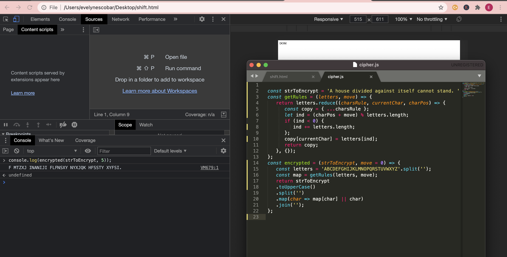

# EncryptionCeasarShift

#Created a simple caesar shift cypher using javascript

# A Caesar Cipher is an encryption to replace each plaintext letter with a different one a fixed number of places down the alphabet. I created this simple shift cypher using javascript for an assignment. I converted my string to uppercase first and then shifted 5 letters to the right.

